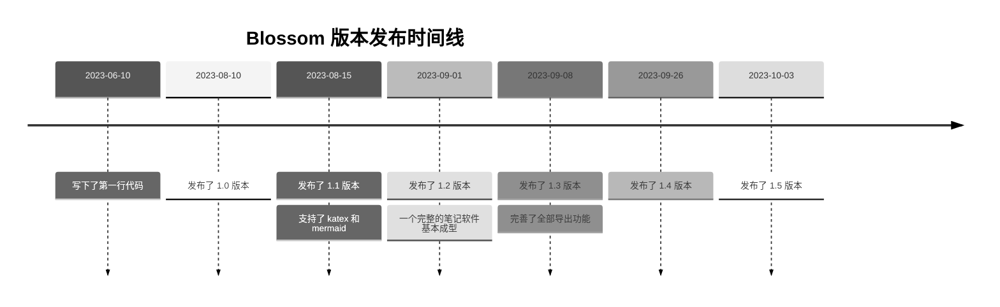

# 一、Blossom Editor 对 Markdown 的语法拓展

在原生语法上通过格式约定来进行拓展, 而不是增加新的语法,
这样不破坏原有 Markdown 格式. 保证文章在其他编辑器中可以正常显式.

一个反例是: 在使用语雀时, 如果在表格中插入了代码块, 则表格在其他编辑器中无法正常渲染. Blossom 尽量不增加这种特性. 虽然降低了格式的丰富性, 但保证了可迁移性.

## 1）思维导图

```markmap
# Blossom
## 文章编辑
## 照片墙管理
## 待办事项
## 日历计划
## 便签
## 其他多种功能
```

## 2) 图片格式拓展

可以为图片**增加阴影**, 以及指定**图片宽度**, 使用格式如下

```sh

```

上面格式解析为

- 图片名称为 照片A
- 图片包含阴影
- 图片宽度为`100%`, 如果宽度不以`%`结尾, 则会以像素计算. 如果未指定宽度, 则会以图片宽度为准, 且宽度最大不超过`100%`

示例:


---

## 3) 视频拓展

视频拓展,在多行代码块基础上拓展

支持格式如下

1. bilibili

```
实际使用时, 需改为标准三个 "`" 的标准 Markdown 格式
``bilibili##bvid##w100%##h300
``
```

上面格式解析为

- `bilibili`: 解析为 bilibili 视频
- `bvid`: 视频bvid
- `w100%`: 视频宽度为`100%`, 如果宽度不以`%`结尾, 则会以像素计算. 如果未指定宽度, 则为`100%`
- `h300`: 视频宽度为高度为300px, 高度不能以百分比的方式设置. 如果未指定宽度, 则为`300px`

示例:

```bilibili##BV1oh4y187VS##w100%##h300

```

---

## 4) ProcessOn 拓展

暂无, 直接使用 ProcessOn 提供的 iframe

---

## 5) 多色引用快

> ##blue##
>
> 引用可以指定颜色, 例如该文本的蓝色引用使用方式如下

```html
> ##blue##
> 可以在上方使用 ##颜色##的方式指定引用的颜色
```

目前支持7种颜色

> 默认

> ##black##
> ⚫ 黑色 ##black##

> ##green##
> 🟢 绿色 ##green##

> ##yellow##
> 🟡 黄色 ##yellow##

> ##red##
> 🔴 红色 ##red##

> ##blue##
> 🔵 蓝色 ##blue##

> ##purple##
> 🟣 紫色 ##purple##

---

## 6) 使用表格进行简单的布局

表格标题中填写 `##container##`, 表格将不显示头部以及边框, 例如

```
| ##container## | head 将会被隐藏 |
|---------------|-----------------|
| column 1      | column2         |
```

上述 Markdown 格式将会被解析成

| ##container## | head 将会被隐藏 |
| ------------- | --------------- |
| column 1      | column2         |

**下面是更多的例子**

---

**三列布局**

|##container##|||
| :-------------------------: | :---------------------------------: | :------------------: |
| <br/>第一行<br/>第二行: 换行请使用换行符`</br>` |  | 12312312312312322222 |

---

**三列布局, 第一列左对齐, 第二列居中, 第三列右对齐**

| ##container## |        |       |
| ------------- | :----: | ----: |
| left          | middle | right |
| left          | middle | right |
| left          | middle | right |
| left          | middle | right |

---

**四列布局, 每列都居中**

| ##container## |        |        |        |
| :-----------: | :----: | :----: | :----: |
|    middle     | middle | middle | middle |
|    middle     | middle | middle | middle |
|    middle     | middle | middle | middle |
|    middle     | middle | middle | middle |

---

> ##yellow##
> 🟡 注意
>
> Markdown 的表格在内容较多时会比较混乱, 所以基于表格布局时通常只用在图片布局, 以及一些简单的介绍场景.
>
> 如果要进行更为复杂的布局, 或在内部有大量内容时, 还是建议使用 `HTML + style` 的方式自定义布局样式.
>
> 下面是作者常用的一种用法

|                                    ##container##                                    |
| :---------------------------------------------------------------------------------: |
|  |
|                         **这是我捡到的一只蠢猫**, 它叫鲁班                          |
|                          它把自己从**5斤**吃到了**15斤**!                           |
|                                  但是我很喜欢它 😸                                  |

```

|                                    ##container##                                    |
|:-----------------------------------------------------------------------------------:|
|  |
|                          **这是我捡到的一只蠢猫**, 它叫鲁班                         |
|                           它把自己从**5斤**吃到了**15斤**!                          |
|                                 但是我很喜欢它 😸                                  |
```

> ##green##
>
> 在 markdown 中，如果你使用中英文等宽的字体，在编辑表格时会更加美观，例如：[更纱黑体](https://github.com/be5invis/Sarasa-Gothic)

---

## 7) 字体颜色

为了保证 Markdown 内容在不同编辑工具的兼容性，字体颜色使用 HTML 标签方式实现。

许多 Markdown 编辑器都支持直接解析 HTML 内容，但私有协议的编辑器可能在解析时会将 HTML 部分解析为正文内容，所以这可能需要你根据自己常用的工具来自行决定是否使用字体颜色，<span style="color:red">**原生 Markdown 语法中是不支持字体颜色的。**</span>

例如下面这段话在 Markdown 中的内容是

<span style="color:red">我是红色</span>,
<span style="color:blue">我是蓝色</span>,
<span style="color:#899911">我是某个绿色</span>

<span style="text-decoration:underline;">我有下划线</span>,
<span style="border:2px solid black">我有边框</span>,
<span style="border:2px dashed green">我也有边框</span>

```html
<span style="color:red">我是红色</span>,
<span style="color:blue">我是蓝色</span>,
<span style="color:#899911">我是某个绿色</span>

<span style="text-decoration:underline;">我有下划线</span>,
<span style="border:2px solid black">我有边框</span>,
<span style="border:2px dashed green">我也有边框</span>
```

---

## 8) 双链引用, 文章引用网络 🔥 

- [x] 引用文章时, 判断引用的文章是否为内部文章, 如果是内网文章, 将以特殊一些的格式显示.
- [x] 文章引用网络图表

引用文章的格式, 需要在链接最后的标题中, 通过双`##`符将内部文章的ID包裹住, 这样则会解析成为内部文章引用, 如下:

```markdown
[📒 关于Blossom笔记](https://www.wangyunf.com/blossom/#/articles?articleId=20151 "##20151##")

"##20011##" 说明该文章时内部文章, ID 为 20151
```

上述内部文章引用会被解析成: [📒 关于Blossom笔记](https://www.wangyunf.com/blossom/#/articles?articleId=20151 "##20151##"), 鼠标移动上去会有特殊的提示效果.

> ##blue##
> 当然, 是可以通过校验 [链接域名] 与 [服务器域名] 是否相同的的方式来判断是否为内部文章, 但是通过ID指定是一种更加直观的和准确的判断方式。

为了方便使用, 可以在文章菜单右键中直接复制文章的内部引用格式，你可以右键点击左侧的某个文章来试试看！

> ##yellow##
> 🟡 注意:
>
> - 在 Blossom 的桌面应用点击内部引用链接, 会打开一个新应用窗口查看该链接内容, 而点击其他链接时, 则会使用默认浏览器打开。

---

## 9) katex 支持

支持行内公式, 例如: 质能方程 `$E = mc^2$` 是一个优雅而伟大的公式

也可以使用代码块书写复杂公式:

```katex
\left\{ \begin{array}{l}
0 = c_x-a_{x0}-d_{x0}\dfrac{(c_x-a_{x0})\cdot d_{x0}}{\|d_{x0}\|^2} + c_x-a_{x1}-d_{x1}\dfrac{(c_x-a_{x1})\cdot d_{x1}}{\|d_{x1}\|^2} \\[2ex]
0 = c_y-a_{y0}-d_{y0}\dfrac{(c_y-a_{y0})\cdot d_{y0}}{\|d_{y0}\|^2} + c_y-a_{y1}-d_{y1}\dfrac{(c_y-a_{y1})\cdot d_{y1}}{\|d_{y1}\|^2} \end{array} \right.
```

---

```katex
\begin{CD}
  RCOHR'SO_3Na @>{\text{Hydrolysis,$\Delta, Dil.HCl$}}>> (RCOR')+NaCl+SO_2+ H_2O
\end{CD}
```

在编辑器中点击右键，菜单中可以选择跳转至 katex 在线编辑器来校验你的语法是否正确。

---

## 10) Mermaid 支持

同样支持 mermaid 图表，在编辑器中点击右键，在菜单中可以选择跳转至 mermaid 在线编辑器来校验你的语法是否正确。


